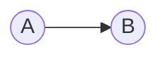
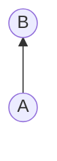
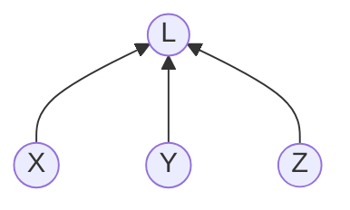
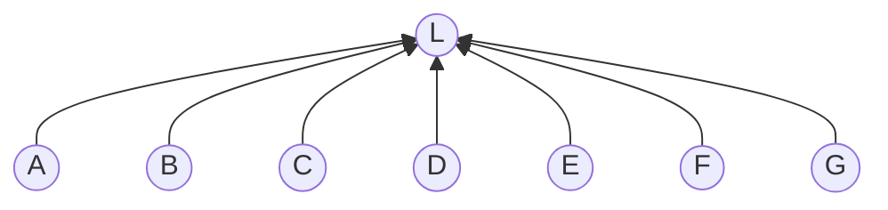
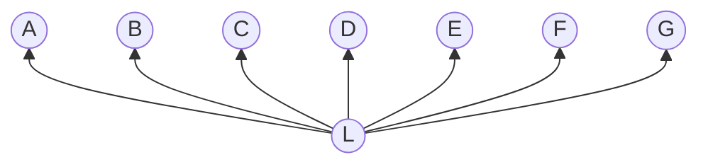
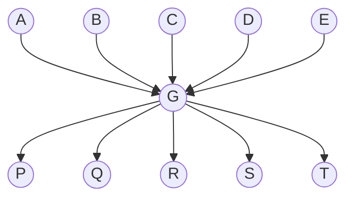
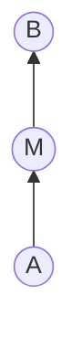
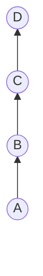


A node is anything you can depend on: a class, a method, a package.
An arrow is a reference plus an invocation.
As more things depend on a node, unwanted ripples become more likely, so the node gets harder to change.
Flip the arrows — a move in the structure, not in the examples — and you get the inverse: harder *not* to change.
Both at once is a god object — hard to change and hard not to change.
Layers look like they attenuate ripples.
That frame is not locked yet.


Related: [The Dark Side of DRY](/docs/dark-side-of-dry), [Scalability of Composition](/docs/scalability-of-composition), [The Calculus of Maintainable Software](/docs/calculus-of-maintainable-sw), [Depending on Behaviour versus Depending on Data](/docs/depending-on-behaviour-versus-data).

This is a foundation article, not a Mix-Ins axiom.
The diagrams carry the cases.
The same arrows describe classes, methods, packages, services, teams.

## A node

A dot is a point on which you can depend.

It might be a class.
It might be a method.
It might be a package, a service, a table, a team.
The shape does not care.
Anything that can be named and referenced is a node.

## An arrow

An arrow is the dependency relationship.

`A → B` means *A depends on B*.
A has a reference to B and invokes it in some way.
That can be one method calling another.
It can be one class calling a method on another class.
Change in B may ripple to A, against the arrow.

## As dependants rise

Start with one thing depended on by one other thing.

A method depended on by one other method is a little harder to change.
You have one other site to think about.
The ripple has somewhere to go.

Three is already a crowd.

Now let the number keep rising.

Twenty-five dependants.
A hundred.
A thousand.
The node is now really hard to change.
It is hard even to understand the consequences.
As the number of dependants rises, the likelihood of unwanted ripple effects rises with it.
A node many others depend on tends to *freeze*: `ApplicationRecord`, a shared kernel, a published API.

## The move

So far the likeness came from the domain.
A node.
An arrow.
More things depending on one node, and that node getting harder to change.
That already looks like a directed graph.

Once the likeness holds, you step into the structure and reason there.
Then you map the result back into the domain.
That is how you find a relationship that was true in the software and not obvious from the examples alone.

## Flip the arrows

The structure lets you reverse every arrow.
What does the domain say then?

You get the inverse.
There are more pathways *into* that node where a ripple can arrive.
A change in any collaborator can force a change here.
The first shape made something harder to change.
This shape makes something harder *not* to change.
A controller that knows every model.
A facade that talks to everyone.
A test that stubs the world.

Depending on many others is close to having one class with many collaborators, or many concerns left unseparated.
That is equivalent, in form, to a very large object doing many things at once — each of which may change.

## Both

Now put both shapes on the same node.

Depended on by many, and depending on many.
Hard to change, and hard not to change.
Ripples leave, ripples arrive, and the node is always in motion.
That is a god object.
It is a massive antipattern.
That pair is what the structure gave back.
Fan-in and fan-out are the same shape, opposite direction.

| Topology | Role | Tendency |
|---|---|---|
| High fan-in | Depended on by many | Harder to change — freezes |
| High fan-out | Depends on many | Harder *not* to change — volatile |
| Both | Hub | Hard to change *and* hard not to change — a god object |
| Long paths | Layered | Looks like attenuation — frame not locked |

DRY's vertical coupling ([Dark Side of DRY](/docs/dark-side-of-dry)) is a hub: many sites → one abstraction, short paths, ripples both ways.
Scalability's P is *degree*; this article is *paths* ([Scalability of Composition](/docs/scalability-of-composition)).

## How does software work at all?

If depending on many things makes a node harder *not* to change, how does any real system survive?
A Rails app depends on hundreds of gems.
A service depends on a forest of packages.
Those are not small fan-outs.

The count of arrows is not the whole story.
Something about path length seems to matter.
The frame for that is not yet in hand.

## Insert a layer

The single arrow was one hop.

A change in B may reach A in one step.
If each hop carries a chance *p* less than one, one hop is about *p*.

Now put something in the middle.

Two hops look like *p* × *p*.
The middle node is not just indirection.
It looks like attenuation.
It also looks like the start of a probability semiring on the paths.
Whether that is the right structure is still open.

A leaky layer is a short path with a longer name.

## Layers

A real stack repeats the same idea.

Many edges.
Few short paths from a frozen core to the edge.
A change in the data layer has more hops to cross to reach the UI.
That would drive the chance down if the hop model holds.

It is interesting.
It is not yet the same kind of find as flipping the arrows.

## Map to examples (stub)

- Rails `ApplicationRecord` — high fan-in, frozen.
- A concern included everywhere — high fan-in *and* no layer (D=2); ripples do not attenuate.
- A role interface / DI collaborator — the inserted M.
- A controller that knows every model — high fan-out, volatile.
- A god class that everyone calls and that knows everyone — both.
- A deep package tree that is still calm — many edges, long paths.

Return to this with one diagram per example.

## Transferable

The same arrows describe classes, packages, services, teams.
Maintainability is a property of the graph's shape.

## Decisions already locked

- Title: Dependencies in the Abstract. Not a Mix-Ins splinter; a foundation piece under the Calculus.
- Arrow: depender → depended-on. Ripple travels the other way.
- A node is anything you can depend on; an arrow is a reference plus an invocation.
- Fan-in: harder to change. Fan-out: harder not to change. Both: a god object.
- The move: build the likeness from the domain; once it holds, reason in the structure; map back.
- Flip the arrows was the first payoff of that move.
- The working name for the structure is a probability semiring over the dependency graph.
- Layers as attenuation is interesting; that frame is not locked.
- Diagrams do the carrying; examples come after the shapes.
