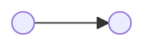


Dependencies are a DAG.
The *topology* of that graph is what makes a system maintainable — not how many edges it has.
Model change as a probability: each hop can fail to propagate, so an entity in the middle *attenuates* ripple risk.
That is why a project with many dependencies can still be stable — there are layers between them.
A node many others depend on is likely to *send* ripples, so it freezes.
A node that depends on many others is likely to *receive* ripples, so it changes.


Related: [The Dark Side of DRY](/docs/dark-side-of-dry), [Scalability of Composition](/docs/scalability-of-composition), [The Calculus of Maintainable Software](/docs/calculus-of-maintainable-sw), [Depending on Behaviour versus Depending on Data](/docs/depending-on-behaviour-versus-data).

This is a foundation article, not a Mix-Ins axiom.
A few diagrams should carry the examples.
The same logic transfers to architecture in general.

**Convention.**
One node with an arrow to another means the first depends on the second.



`A → B` means *A depends on B*.
Change in B may ripple to A (against the arrow).

## Outline (working)

### Two nodes

```
  A ──────────────► B
  ▲    depends on   │
  └── ripple of ────┘
      change
```

A is the depender.
B is the depended-on.
If B changes, A might have to.

### Insert a layer — probability attenuates

```
  A ────► M ────► B
```

Let each hop propagate a change with probability *p* < 1.
Direct `A → B`: risk ≈ *p*.
Via M: risk ≈ *p* × *p*.
The middle entity is not just indirection.
It is attenuation.

That is why a system with a *large* number of dependencies can be stable: the paths are long.
Count of edges is the wrong fear.
Path length and layering are the right ones.

### Layers

```
  UI ──► app ──► domain ──► data
```

Many edges.
Few short paths from a frozen core to the edge.
A change in `data` must cross three hops to reach `UI`.

### Fan-in: depended-on by many — sends ripples, freezes

```
  X ──► L
  Y ──► L
  Z ──► L
```

L is likely to *send* a ripple if it changes.
Changing L becomes expensive, so L becomes **frozen**.
`ApplicationRecord`, a shared kernel, a published API.

### Fan-out: depends on many — receives ripples, changes

```
        ┌──► P
  C ────┼──► Q
        └──► R
```

C is likely to *receive* a ripple.
C becomes **likely to change**.
A god object, a facade that knows everyone, a test that stubs the world.

### Send vs receive

| Topology | Role | Tendency |
|---|---|---|
| High fan-in | Depended on | Sends ripples → freezes |
| High fan-out | Depends on many | Receives ripples → volatile |
| Long path / layers | Indirect | Attenuates — *pⁿ* |
| Short path / hub | Direct | Every change is everyone's |

DRY's vertical coupling ([Dark Side of DRY](/docs/dark-side-of-dry)) is a hub: many sites → one abstraction, short paths, ripples both ways.
Scalability's P is *degree*; this article is *paths* ([Scalability of Composition](/docs/scalability-of-composition)).

## Map to examples (stub)

- Rails `ApplicationRecord` — high fan-in, frozen.
- A concern included everywhere — high fan-in *and* no layer (D=2); ripples do not attenuate.
- A role interface / DI collaborator — the inserted M.
- A controller that knows every model — high fan-out, volatile.
- A deep package tree that is still calm — many edges, long paths.

Return to this with one diagram per example.

## Transferable

The same arrows describe classes, packages, services, teams.
Maintainability is a property of the graph's shape.

## Decisions already locked

- Title: Dependencies in the Abstract. Not a Mix-Ins splinter; a foundation piece under the Calculus.
- Arrow: depender → depended-on. Ripple travels the other way.
- Change as probability per hop; a layer attenuates.
- Fan-in freezes; fan-out volatilises.
- Diagrams do the carrying; examples come after the shapes.

## Rough draft

*(Prose begins here once the outline settles.)*
